# Modern-Ecommerce-Platforms
Design and Develop Modern Ecommerce Plaffor

# Project Overview

Website design for selling fresh, 100% pure Arabica coffee beans. We distribute roasted coffee. There will be 3 levels: light roast coffee, medium roast coffee, and dark roast coffee. We can be confident that our coffee is of excellent quality and premium. and have standards in production It is coffee grown using natural methods. Do not use chemicals in growing. and take care of every step of producing quality coffee By choosing to design a website that is simple to use and not complicated to facilitate customer access. The website is designed through WordPress, a website-making platform that is very popular in today's era because of its simplicity and many add-ons used for website development. The strengths that we choose to use WordPress are: easy to create a website, secure, and frequently upgraded. This is considered a strong point of the program because WordPress is a website creation platform that has system upgrades and the capabilities of the system often That will make our website work more efficiently. Can be used in a variety of ways than before. And it's more convenient than before if you want to edit your website and create websites in a variety of theme And WordPress Plugins have a variety and equipment to work with the website. If you change it again The website will change format.
And it can be done in many languages. WordPress is popular all over the world. This makes it possible to support multiple languages. There are also plugins created to support multilingual websites and to be able to do business with WordPress Can be made and sold to various users You can create work and market with WordPress yourself by making themes and plugins that are worth sending to the market continuously.

**Laragon** The reason to use laragon is that it is a web server emulator. Laragon is fast and efficient for PHP, Node.js, Python, Java, Go, Ruby. It is fast, lightweight, easy to use, and easily extensible. Especially for building and managing modern web applications. Focus on efficiency Designed with stability in mind Simplicity, flexibility and freedom, so you'll find Laragon works quickly and smoothly.

### Steps to install Laragon

- Click Next.

- Select the installed storage location as desired.

- Click Next >

- Click Install.

- The program is installing.

- The installation program is finished. Press Finish.

- Next will be installing wordpress.

### Steps to install WordPress on localhost (Laragon)

- Step 1 : Download the latest version of WordPress onto your machine before wordpress.org

- Step 2 : Copy all files/folders to laragon and give the folder a simple name for easy opening of wordpress on wep.

- Step 3 : Press Start All.

- Step 4 : Create a database / collation: utf8_general_ci and give the database a short name for filling in data in WordPress.

- Step 5 : Press to Wep.

- Step 6 : Bring up the Install WordPress page by pressing localhost/folder name/press enter, you will be prompted to fill in information.

- Step 7: Login into WordPress and you're done.

#### Visual Paradigm 
Visual Paradigm is a leading and globally recognized provider for Business and IT Transformation software solutions. It enables organizations to improve business and IT agility and foster innovation through popular open standards. Our award-winning products are trusted by over 320,000 users in companies ranging from small business, consultants, to blue chip organizations, universities and government units across the globe. About Visual Paradigm Visual Paradigm.

After we have successfully logged in, it will bring up Wordpress for us. There won't be much there. Everything we want to do or want we have to download ourselves. Download it within Wordpress. The first thing we need to do is our website page. in making website pages We have two paths to choose from. First, design it yourself. Second, find other people's themes and change them into your website page. I chose to find someone else's theme to use, which I chose the theme of Coffee Block version 1.0 By SKT Themes.
his website page. His theme will be selling coffee beans and giving knowledge about coffee. which is very similar to my concept. So I have chosen our theme to change to my website for selling coffee beans. We have chosen the theme and the next step is to decorate our website page. How do you want it to be? Whatever you want, we can do as we want. We've finished decorating everything. Next, we'll add a plugin. First, we have to explain what a plugin is. A plugin is an add-on to WordPress in the form of a script that will help increase efficiency. and expand the ability to make ordinary websites It has become a complete website. More suitable for use in each purpose. 

#### What plug-ins do you use?
- **Woocommerce**
What is Woocommerce and what are its advantages?
It is a plugin that can turn a simple WordPress website into an e-commerce website in just a few clicks. With a variety of abilities Sell many types of products Whether it is an ordinary product that can be tangible Digital file type products.
WooCommerce can do everything a basic e-commerce website should have, such as a membership system, payments, shipping, warehouse management, and sales reporting system. and many other subsystems.

- **PDF Invoices & Packing Slips for WooCommerce**
It will be a plugin to add a PDF invoice to send along with the order confirmation email that will be sent to the customer. Comes with templates and can also customize the appearance or create our own templates.

- **PeproDev WooCommerce Receipt Uploader**
Upload Receipt for Any Payment method in WooCommerce. Customers will Upload the receipt (image/pdf) and Shop Managers will approve/reject it manually.

## Website overview

### HomePage

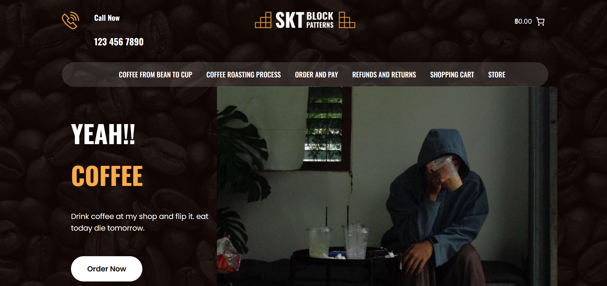

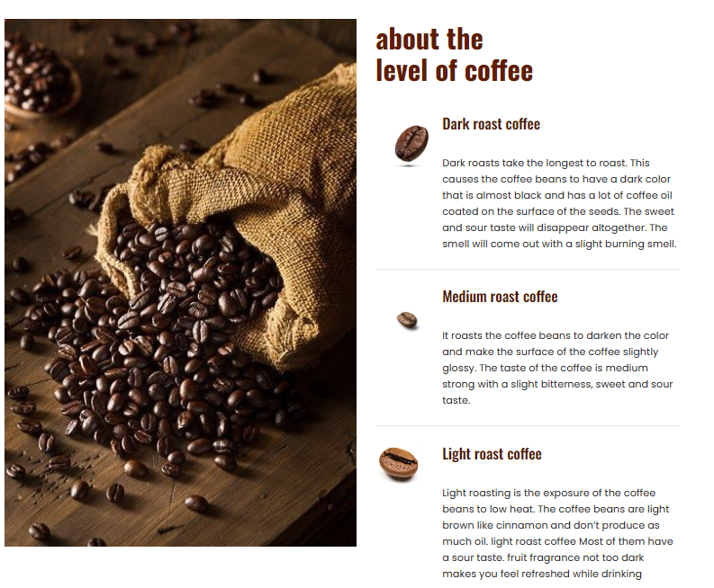
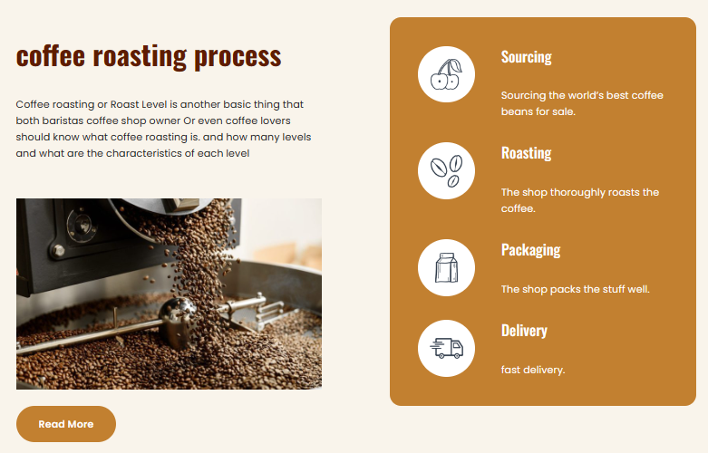
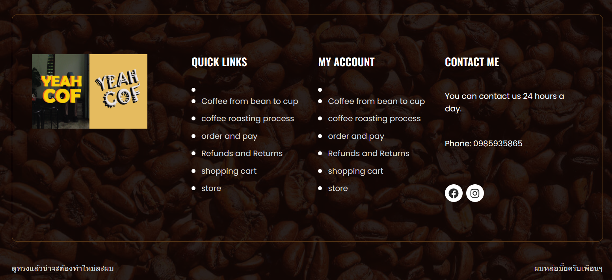

#### Shoppage

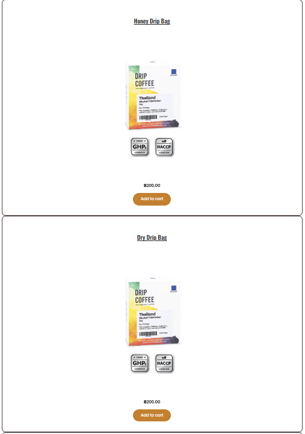

#### Cart

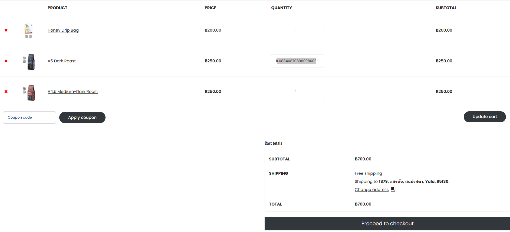

# BPMN Diagram

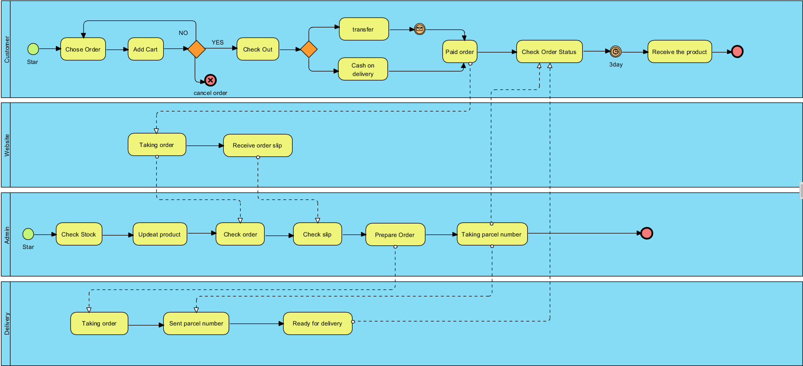
This BPMN diagram shows my ecommerce website process. It showcases key interactions and workflows that enhance the platform's user-friendly online coffee shop experience.

### All Pools in BPMN
- Customer
- Website
- Admin
- Delivery

#### Customer pool

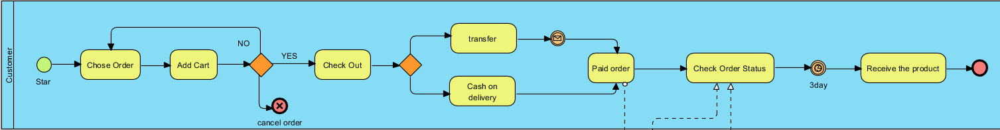
- Start with the green dot. It marks the beginning of the customer journey on the platform.
- Select Products: The customer selects the desired products from the available options.

- Add product to cart: After selecting the product step The customer checks in to the cart. If the customer is satisfied with the selected product They will go through the payment process. If the customer still hesitates in choosing a product, the customer can cancel the product or go back and select it again.

- Checkout Process: The process to Checkout the product.  (The customer fill their shipping detail.)
  - **Fill the shipping detail:** The customer fill their shipping detail.
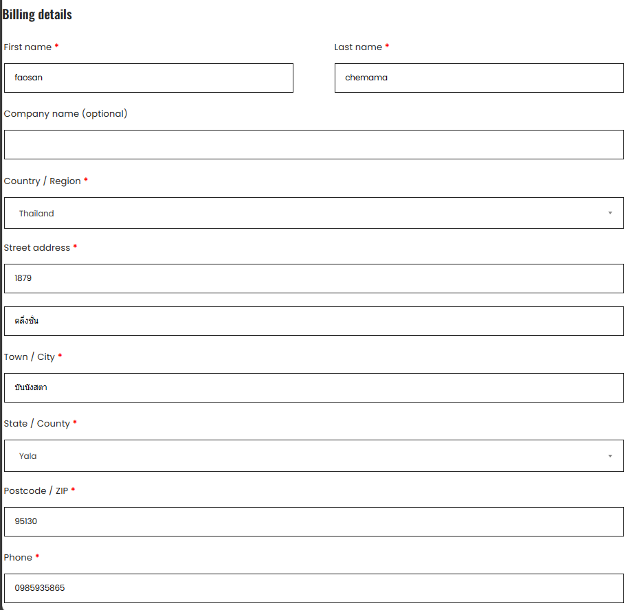
 - **Identify payment method:** customer choose the payment method. In my wetsite have 2 ways are 2C2P, and Bank transfer.
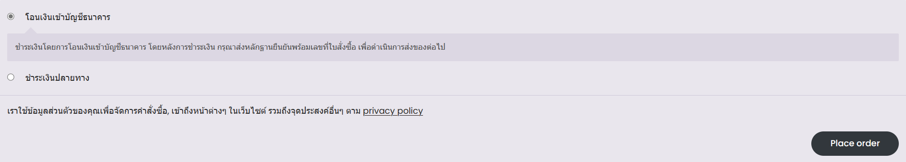
- Payment Process: There are 2 methods to choose from. The first method is cash on delivery. The second method is a bank transfer. Customers can pay at their convenience. (Destination or bank transfer) for bank transfer Customers can send proof of transfer right away. We will have a place to send evidence to you. If the customer pays on delivery, the customer waits to pay when the driver comes to deliver the product.
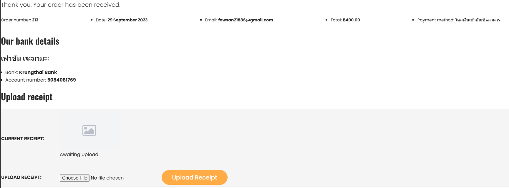

#### Website pool

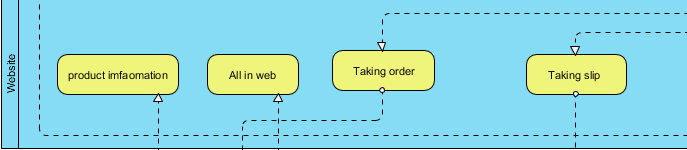

- Receive orders from customers in order to wipe customer slips.
- Check slip and confirm order process: This process admin will check the slip of payment and confirm order. When checking the correctness of payment If correct, it will enter the stock checking process. If it is incorrect, the order will be canceled.
- Stock checking process: Admin will check stock. If there is enough product, it will proceed to the next step. (Prepare orders for delivery)

#### Admin pool

- The next step will be preparing the customer's order. Pack the product well so that it is not damaged during the delivery.
- Customer order is ready to ship.
- Next, the order will be sent to the shipping company.

#### Delivery pool

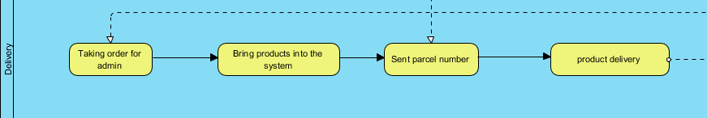

- The shipping company receives orders from admins in order to deliver goods to customers.
- Next, the parcel number will be sent to the admin in order for the admin to send the parcel number to his customers.
- Next, the product will be sent to the customer in at least approximately 3 days (if we make payment on delivery, we can wait to pay for shipping).

#### Delivery Status
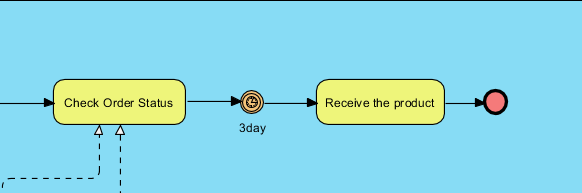
- Once the item leaves the originating courier company, it takes three days to reach its destination.
Once the item leaves the originating courier company, it takes three days to reach its destination.

#### Summary
- YEAH  e-commerce website is a testament to the power of digital transformation in the world of bookselling. It combines the flexibility and user-friendly nature of WordPress and WooCommerce with careful customization and strategic plugin integration.
