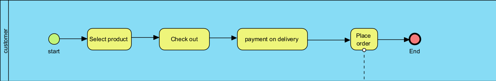
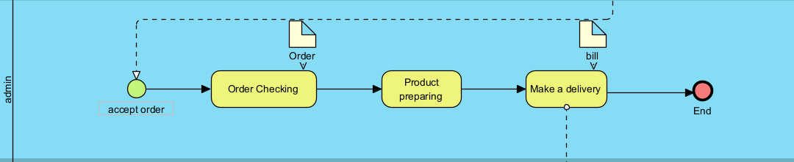
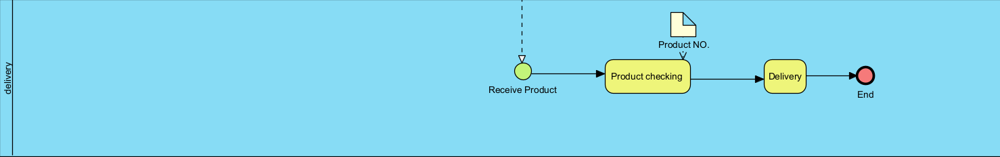

# Modern-Ecommerce-Platforms
Design and Develop Modern Ecommerce Plaffor
Project Overview
My website is a website that sells coffee beans and has a workflow or business model. 

My model will have three parts: 
1. Customer
2. System administrator
3. Shipping company

The first part starts with the customer coming to find the product on the website and the customer can click to order right away via the payment method on delivery. First of all, I have to inform that my website or shop does not have any teachings.

The aforementioned format is the same as in this picture.

And in the second part is the admin part.

Admin will have a duty to receive orders and pack, produce and send products to the shipping company.

and in the third part will be a transport company

The transport company is responsible for receiving products from admin and sending them to customers.

These are all my early models.
